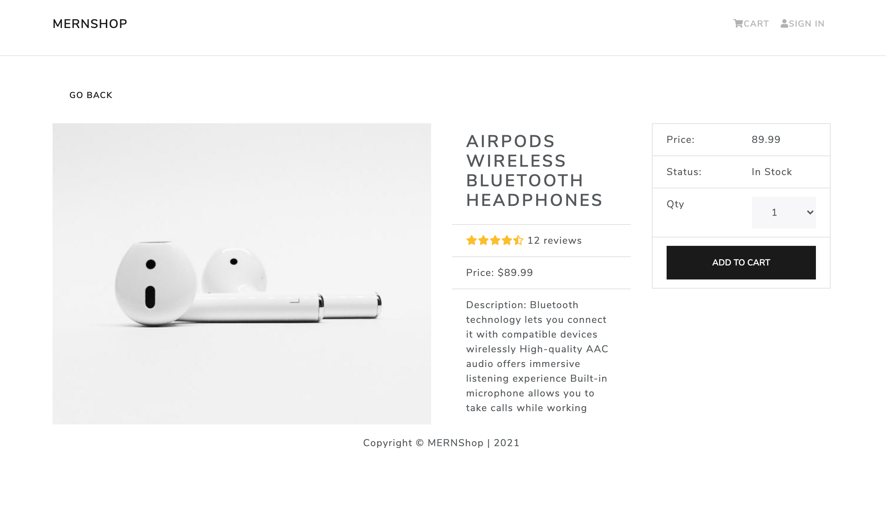

# MERNSHOP
>  A full-stack MongoDB, ExpressJS, NodeJS & React + Redux e-commerce website.



## Table of Contents

* [Features](#features)
* [Installation](#installation)
* [Built With](#built-with)
* [Contributing](#contributing)
* [Acknowledgments](#acknowledgments)
* [Authors](#author)
* [License](#license)

## Features

- A user can get a list of products.
- A user can get single products.
- A user can sing up and sing in.
- A user can add items to cart.
- A user can buy products via PayPal.

## Installation

You can get a local copy of the repository please run the following commands on your terminal:
```
$ cd <folder>
$ git clone git@github.com:dansantander/mernshop.git
$ npm install
$ npm start
```

## Built With

- React
- React Hooks
- Redux
- NodeJS
- ExpressJS
- Mongoose
- Bootstrap

## Contributing

Contributions, issues and feature requests are welcome!

You can do it on [issues page](issues/).

## Acknowledgments

Special thanks to code reviewers.

## Show your support

Give a ⭐️ if you like this project!

## Authors

👤 **Daniel Santander**

- Github: [@dansantander](https://github.com/dansantander)
- Linkedin: [Daniel Santander](https://www.linkedin.com/in/daniel-santander)
- Twitter: [@dansantandr](https://twitter.com/dansantandr)

## License

<strong>Creative Commons 2020</strong>